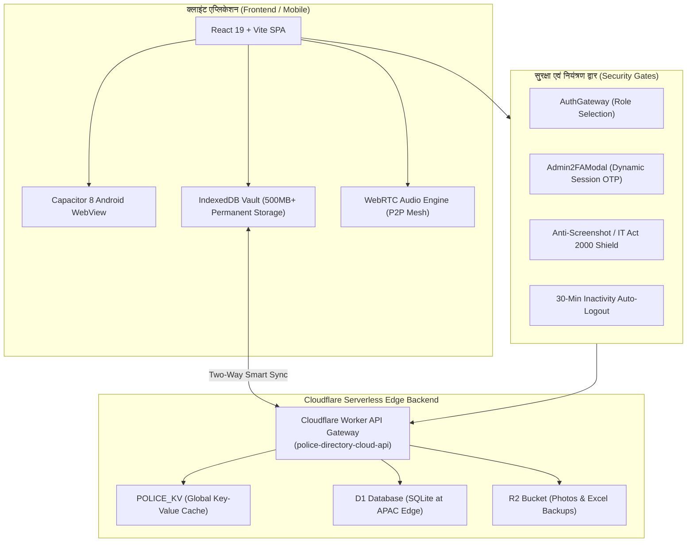

# 🚔 उत्तर प्रदेश पुलिस - आधिकारिक डिजिटल संपर्क निर्देशिका एवं संचार प्रणाली
### (UP Police Departmental Directory, Communication & Admin Portal)

[](https://react.dev/)
[](https://vitejs.dev/)
[](https://capacitorjs.com/)
[](https://workers.cloudflare.com/)
[](https://uppolice.gov.in)

उत्तर प्रदेश पुलिस विभाग के समस्त **75 जनपदों** के 50,000+ पुलिस अधिकारियों एवं कर्मचारियों हेतु निर्मित अति-सुरक्षित, उच्च-प्रदर्शनयुक्त, आधुनिक विभागीय दूरभाष निर्देशिका (Police Directory), वेबआरटीसी (WebRTC) वॉइस कॉलिंग, एन्क्रिप्टेड चैट तथा केंद्रीकृत प्रशासनिक नियंत्रण पोर्टल।

---

## 📑 विषय-सूची (Table of Contents)

1. [सिस्टम आर्किटेक्चर (System Architecture)](#-सिस्टम-आर्किटेक्चर-system-architecture)
2. [मुख्य विशेषताएं एवं मॉड्यूल (Key Features & Modules)](#-मुख्य-विशेषताएं-एवं-मॉड्यूल-key-features--modules)
3. [क्लाउड बैकएंड एवं डेटाबेस (Cloud Backend & Database)](#-क्लाउड-बैकएंड-एवं-डेटाबेस-cloud-backend--database)
4. [शासकीय सुरक्षा एवं गोपनीयता प्रोटोकॉल (Security & Compliance)](#-शासकीय-सुरक्षा-एवं-गोपनीयता-प्रोटोकॉल-security--compliance)
5. [प्रोजेक्ट डायरेक्टरी संरचना (Project Directory Structure)](#-प्रोजेक्ट-डायरेक्टरी-संरचना-project-directory-structure)
6. [एक्सेल बल्क डेटा प्रारूप (Excel Bulk Import Format)](#-एक्सेल-बल्क-डेटा-प्रारूप-excel-bulk-import-format)
7. [डेवलपमेंट एवं इंस्टॉलेशन गाइड (Development & Setup)](#-डेवलपमेंट-एवं-इंस्टॉलेशन-गाइड-development--setup)
8. [एंड्रॉयड एपीके / बंडल निर्माण (Android APK & AAB Build)](#-एंड्रॉयड-एपीके--बंडल-निर्माण-android-apk--aab-build)
9. [प्रशासकीय क्रेडेंशियल्स एवं एक्सेस रोल्स (Credentials & Roles)](#-प्रशासकीय-क्रेडेंशियल्स-एवं-एक्सेस-रोल्स-credentials--roles)
10. [Cloudflare Edge API संदर्भ (API Reference)](#-cloudflare-edge-api-संदर्भ-api-reference)

---

## 🏛️ सिस्टम आर्किटेक्चर (System Architecture)



---

## 🌟 मुख्य विशेषताएं एवं मॉड्यूल (Key Features & Modules)

### 1. 👑 बहु-स्तरीय भूमिका-आधारित प्रमाणीकरण (Role-Based Access Control)
* **Super Admin (मुख्यालय पुलिस महानिदेशक)**:
  * समस्त 75 जनपदों के कार्मिकों का संपूर्ण नियंत्रण।
  * Co-Admins की नियुक्ति, संपादन व अधिकार निष्कासन।
  * एक्सेल बल्क इम्पोर्ट व संपूर्ण डेटाबेस का ऑटो/मैन्युअल सिंक।
  * जनपद स्थानांतरण (District Transfer) की अंतिम स्वीकृति।
  * 6-घंटे का स्वचालित रोलिंग बैकअप प्रबंधन।
  * शासकीय नीतियों (Policies CMS) एवं मास्टर डेटा (पद, थाना, ज़िला) का संपादन।
* **District Co-Admin (ज़िला नोडल अधिकारी)**:
  * केवल अपने आवंटित जनपद (उदा. लखनऊ, कानपुर, वाराणसी) तक सीमित अधिकार क्षेत्र।
  * स्थानीय कार्मिकों के स्व-पंजीकरण आवेदनों की समीक्षा व स्वीकृति/अस्वीकृति।
  * जनपद स्थानांतरण आवेदनों की जांच कर पुलिस मुख्यालय को अग्रसारित (Forward) करना।
  * अपने जनपद हेतु एक्सेल बल्क डेटा अपलोड।
* **Police Personnel (सत्यापित पुलिस कार्मिक)**:
  * राज्यस्तरीय व जनपदस्तरीय संपर्क खोज।
  * वर्दी फोटो अपलोड एवं अनिवार्य विभागीय सत्यापन।
  * नंबर गोपनीयता टॉगल (Hide Mobile Number)।
  * अंतर्विभागीय पीयर-टू-पीयर वॉइस कॉलिंग व संदेश आदान-प्रदान।

### 2. 🔍 उन्नत फ़िल्टरिंग एवं खोज प्रणाली (Directory Search)
* **मल्टी-क्राइटेरिया फ़िल्टर**: कार्मिक का नाम, 10-अंकों का PNO नंबर, पद (Rank), जनपद (District), थाना/कार्यालय (Office/Thana) तथा मोबाइल नंबर।
* **उत्तर प्रदेश के समस्त 75 जनपद**: मानक पदनाम (DGP से आरक्षी/फॉलोवर तक) ड्रॉपडाउन में प्री-लोडेड।
* **निजता सुरक्षा**: यदि किसी कार्मिक ने मोबाइल नंबर छिपाया है, तो अन्य कार्मिक को नंबर `XXXXXXXX12` रूप में दिखेगा तथा केवल अनुमति अनुरोध (Permission Request) स्वीकार होने पर ही नंबर उजागर होगा।

### 3. 📞 WebRTC इन-ऐप कॉलिंग एवं पुलिस मैसेंजर (P2P Calling & Chat)
* **अधिकतम 5-मिनट सुरक्षा टाइमर**: अंतर्विभागीय आपातकालीन संवाद हेतु इन-ऐप सुरक्षित वॉइस कॉल। 5 मिनट पूरे होते ही कॉल स्वतः कट जाती है ताकि नेटवर्क एवं विभागीय मर्यादा बनी रहे।
* **विभागीय संदेश कक्ष**:
  * 1-on-1 गोपनीय विभागीय चैट।
  * जनपदीय एवं विशिष्ट ऑपरेशन्स हेतु समूह संदेश (Group Broadcasts)।
  * रियल-टाइम अनरीड मैसेज बैज व स्मार्ट 6-सेकंड पोलिंग सिंक।

### 4. 🔄 2-स्तरीय जनपद स्थानांतरण प्रक्रिया (Strict 2-Tier Transfer Workflow)
1. **स्टेप 1**: कार्मिक प्रोफ़ाइल से नवीन जनपद स्थानांतरण हेतु आवेदन करता है।
2. **स्टेप 2**: संबंधित जनपद का **ज़िला Co-Admin** स्थानांतरण आदेश की समीक्षा कर संतुष्ट होने पर मुख्यालय Super Admin को फ़ॉरवर्ड करता है।
3. **स्टेप 3**: **Super Admin** द्वारा स्वीकृति मिलते ही कार्मिक का आधिकारिक जनपद स्वतः अपडेट हो जाता है।

### 5. 📊 एक्सेल बल्क इम्पोर्ट / एक्सपोर्ट (Excel Engine)
* **ऑफिशियल रजिस्ट्रेशन टेम्पलेट**: आधिकारिक `.xlsx` टेम्पलेट एक क्लिक में डाउनलोड योग्य।
* **स्मार्ट हेडर नॉर्मलाइज़ेशन**: हिंदी अथवा अंग्रेज़ी में लिखे कॉलम (उदा. 'PNO'/'पीएनओ', 'Name'/'नाम', 'Phone'/'मोबाइल', 'Office'/'थाना') स्वतः पहचानकर मैप होते हैं।
* **लाइव 6-चरणीय प्रोग्रेस बार**: सत्यापन, निष्कर्षण, मास्टर डेटा एकीकरण, लोकल स्टोरेज, और Cloudflare लाइव सिंक की रियल-टाइम प्रतिशत प्रगति।
* **शून्य डेटा लॉस**: डुप्लीकेट PNO होने पर रिकॉर्ड स्वतः ओवरराइट/अपडेट होता है, नया होने पर जुड़ता है।

---

## ☁️ क्लाउड बैकएंड एवं डेटाबेस (Cloud Backend & Database)

> [!IMPORTANT]
> **Firebase से Cloudflare पर ऐतिहासिक माइग्रेशन**:
> पूर्व में Google Firebase Spark (मुफ्त योजना) पर 50,000 दैनिक रीड्स की सीमा थी। 500+ कार्मिकों का डेटा होने पर `FirebaseError: [code=resource-exhausted]: Quota exceeded` एरर आ जाता था। इसे पूर्णतः हटाकर **Cloudflare Serverless Stack** पर शिफ्ट किया गया है, जिसकी क्षमता **50,00,000+ अनुरोध प्रतिदिन (100 गुना अधिक)** है और लागत **₹0 (शून्य)** है।

### क्लाउड अवयव विवरण:
| अवयव | तकनीक | उद्देश्य | क्षमता |
| :--- | :--- | :--- | :--- |
| **Edge API Gateway** | Cloudflare Workers | REST API एंडपॉइंट्स, ऑथेंटिकेशन, CORS | वैश्विक स्तर पर <50ms रिस्पॉन्स |
| **की-वैल्यू डेटाबेस** | Cloudflare POLICE_KV | डायरेक्टरी संपर्क, चैट, मास्टर कॉन्फ़िगरेशन | अत्यंत तीव्र कैशिंग व रीड्स |
| **रिलेशनल डेटाबेस** | Cloudflare D1 (SQLite) | स्ट्रक्चर्ड क्वेरीज़ एवं बैकअप | 50 लाख रीड्स / दिन मुफ्त |
| **ऑब्जेक्ट स्टोरेज** | Cloudflare R2 Bucket | कार्मिक वर्दी फोटो, एक्सेल बैकअप स्लॉट्स | 10 GB स्टोरेज मुफ्त, शून्य इग्रेस शुल्क |
| **स्थानीय डेटाबेस** | Browser IndexedDB Vault | ऑफ़लाइन उपलब्धता, डेटा कैश | 500 MB+ प्रति डिवाइस |

---

## 🛡️ शासकीय सुरक्षा एवं गोपनीयता प्रोटोकॉल (Security & Compliance)

* 🚫 **एंटी-स्क्रीनशॉट एवं स्क्रीन रिकॉर्डिंग प्रतिबंध**:
  * कीबोर्ड शॉर्टकट ब्लॉक: `PrintScreen`, `Ctrl+P` (प्रिंट), `Ctrl+S` (सेव), `Ctrl+U` (सोर्स कोड)।
  * डेवलपर टूल्स ब्लॉक: `F12`, `Ctrl+Shift+I`, `Ctrl+Shift+J`, `Ctrl+Shift+C`।
  * माउस राइट-क्लिक पूर्णतः निष्क्रिय।
* 🔐 **प्रशासक 2FA द्वि-चरणीय सुरक्षा (Admin 2FA Gate)**:
  * एडमिन कंट्रोल पैनल खोलने हेतु Two-Factor Authentication अनिवार्य।
  * डायनामिक 6-डिजिट सेशन OTP, मास्टर एडमिन पिन अथवा Co-Admin पासवर्ड समर्थित।
  * ऑटो-फिल OTP की त्वरित सुविधा।
* ⏱️ **30-मिनट इनएक्टिविटी ऑटो-लॉगआउट**:
  * सुरक्षा कारणों से 30 मिनट तक निष्क्रिय रहने पर सत्र स्वतः बंद होकर होम लॉगिन स्क्रीन पर रीडायरेक्ट हो जाता है।
* 📜 **विभागीय नीतियां (Policies CMS)**:
  * आधिकारिक अस्वीकरण (Disclaimer Policy)
  * शासकीय गोपनीयता नीति एवं सेवा शर्तें (Confidentiality & Terms)
  * हाइपरलिंकिंग नीति (Hyperlinking Policy)
  * कॉपीराइट नीति (Copyright Policy)
  * गोपनीयता नीति (Privacy Policy)

---

## 📂 प्रोजेक्ट डायरेक्टरी संरचना (Project Directory Structure)

```
police-directory-app/
├── android/                        # कैपेसिटर नेटिव एंड्रॉयड प्रोजेक्ट
│   ├── app/
│   │   ├── src/main/
│   │   │   ├── AndroidManifest.xml # परमिशन्स, ओरिएंटेशन, हार्डवेयर बैक-बटन
│   │   │   ├── assets/public/      # संकलित वेब एसेट्स (dist बिल्ड)
│   │   │   └── res/                # ऐप आइकन्स (mipmap), स्पलैश स्क्रीन
│   │   └── build.gradle            # एंड्रॉयड बिल्ड कॉन्फ़िगरेशन (SDK 35)
│   └── build.gradle
├── src/
│   ├── components/                 # रियूज़ेबल यूआई कंपोनेंट्स
│   │   ├── ActiveCallModal.jsx     # WebRTC ऑडियो कॉलिंग मॉडल
│   │   ├── Admin2FAModal.jsx       # एडमिन 2FA ऑथेंटिकेशन सुरक्षा गेट
│   │   ├── AdminPanel.jsx          # Super Admin व Co-Admin कंट्रोल पोर्टल
│   │   ├── AuthGateway.jsx         # लॉगिन, Co-Admin, मास्टर पिन गेटवे
│   │   ├── CloudflareSetupModal.jsx# Cloudflare R2 व वर्कर सेटिंग्स
│   │   ├── ContactCard.jsx         # कार्मिक संपर्क कार्ड
│   │   ├── ContactList.jsx         # संपर्क सूची व ग्रिड डिस्प्ले
│   │   ├── HeaderMenuDrawer.jsx    # साइड स्लाइड-ओवर कंट्रोल मेनु ड्रॉवर
│   │   ├── LoginDisclaimerModal.jsx# अनिवार्य शासकीय स्वीकृति गेट
│   │   ├── MessageBoxModal.jsx     # विभागीय इन-ऐप चैट व ग्रुप मैसेजिंग
│   │   ├── MobileBottomNav.jsx     # बॉटम नेविगेशन डॉक (निर्देशिका/संदेश/मेनु)
│   │   ├── NotificationsModal.jsx  # विभागीय परिपत्र व अलर्ट्स
│   │   ├── PolicyModal.jsx         # शासकीय नीतियां व नियम व्यूअर
│   │   ├── PWAInstallPrompt.jsx    # 1-क्लिक PWA ऐप इंस्टॉलर
│   │   ├── RegistrationModal.jsx   # नवीन कार्मिक स्व-पंजीकरण फॉर्म
│   │   ├── SearchFilters.jsx       # बहु-स्तरीय खोज एवं फ़िल्टर बार
│   │   ├── TermsFooter.jsx         # आधिकारिक शासकीय फुटर
│   │   └── UserProfileModal.jsx    # कार्मिक प्रोफ़ाइल व स्थानांतरण आवेदन
│   ├── data/
│   │   └── mockContacts.jsx        # 75 जनपदों व मानक पदों की मास्टर संदर्भ सूची
│   ├── utils/                      # कोर बिजनेस लॉजिक व एडेप्टर्स
│   │   ├── cloudflareR2.js         # Cloudflare Worker, KV व R2 सिंक इंजन
│   │   ├── firebase.js             # कॉम्पैटिबिलिटी एडेप्टर (Redirected to Cloudflare)
│   │   ├── imageCompressor.js      # ऑटो कैनवास इमेज कंप्रेसर (~30KB)
│   │   ├── indexedDB.js            # परमानेंट लोकल IndexedDB वॉल्ट (500MB+)
│   │   ├── nativeBridge.js         # कैपेसिटर नेटिव ब्रिज (Status Bar, Back Button)
│   │   ├── storage.js              # स्टेट मैनेजमेंट, एक्सेल पार्सर, बैकअप इंजन
│   │   └── webrtc.js               # WebRTC P2P मेश कॉलिंग मैनेजर
│   ├── App.jsx                     # मुख्य एप्लिकेशन रूट एवं स्टेट हब
│   ├── index.css                   # खाकी व नेवी-ब्लू थीम स्टाइलिंग
│   └── main.jsx                    # रिएक्ट 19 एंट्री पॉइंट
├── capacitor.config.json           # कैपेसिटर 8 एंड्रॉयड कॉन्फ़िगरेशन
├── vite.config.js                  # विट 8 बंडलर एवं रोलडाउन ऑप्टिमाइज़र
└── package.json                    # निर्भरताएं एवं स्क्रिप्ट्स
```

---

## 📊 एक्सेल बल्क डेटा प्रारूप (Excel Bulk Import Format)

एडमिन पैनल के **"एक्सेल बल्क अपडेट"** टैब से डाउनलोड होने वाले आधिकारिक टेम्पलेट में निम्नलिखित कॉलम मान्य हैं:

| कॉलम शीर्षक (English) | वैकल्पिक शीर्षक (हिंदी) | अनिवार्य? | उदाहरण / विवरण |
| :--- | :--- | :--- | :--- |
| `PNO` | `पीएनओ` | ⚠️ अनुशंसित | `152048912` (अद्वितीय कार्मिक पहचान) |
| `Name` | `नाम` / `कर्मचारी का नाम` | ✅ अनिवार्य | `अमित कुमार सिंह` |
| `Post` | `पद` | ✅ अनिवार्य | `उपनिरीक्षक (Sub Inspector)` |
| `District` | `ज़िला` / `जनपद` | ✅ अनिवार्य | `लखनऊ` (उत्तर प्रदेश के 75 जनपदों में से कोई) |
| `Office` | `थाना` / `कार्यालय` | ⚪ वैकल्पिक | `थाना हज़रतगंज` |
| `Phone` | `मोबाइल` / `फ़ोन` | ✅ अनिवार्य | `9876543210` (10-अंकों का वैध नंबर) |
| `WhatsApp` | `व्हाट्सएप` | ⚪ वैकल्पिक | `9876543210` (खाली होने पर Phone लागू) |
| `Email` | `ईमेल` | ⚪ वैकल्पिक | `amit.singh@uppolice.gov.in` |
| `Password` | `पासवर्ड` | ⚪ डिफ़ॉल्ट | `1234` |
| `Status` | `स्थिति` | ⚪ डिफ़ॉल्ट | `approved` (स्वीकृत) अथवा `pending` |
| `Hide_Phone` | `नंबर छुपाएं` | ⚪ डिफ़ॉल्ट | `No` अथवा `Yes` |
| `Remarks` | `टिप्पणी` | ⚪ वैकल्पिक | `विशेष सुरक्षा दल` |

---

## 🛠️ डेवलपमेंट एवं इंस्टॉलेशन गाइड (Development & Setup)

### आवश्यकताएं:
* Node.js v18+ (अनुशंसित: Node.js v20+)
* npm v9+

### चरण-दर-चरण निर्देश:

1. **रिपॉजिटरी क्लोन करें**:
   ```bash
   git clone https://github.com/mrdkpandey2010-eng/police-directory-app.git
   cd police-directory-app
   ```

2. **डिपेंडेंसी स्थापित करें**:
   ```bash
   npm install
   ```

3. **डेवलपमेंट सर्वर प्रारंभ करें**:
   ```bash
   npm run dev
   ```
   ब्राउज़र में खोलें: `http://localhost:5173/`

4. **प्रोडक्शन बिल्ड तैयार करें**:
   ```bash
   npm run build
   ```
   उत्पादित फ़ाइलें `dist/` फ़ोल्डर में सहेजी जाएंगी।

---

## 📱 एंड्रॉयड एपीके / बंडल निर्माण (Android APK & AAB Build)

एप्लिकेशन Capacitor 8 का उपयोग करती है और सीधे Google Play Store या विभागीय वितरण हेतु तैयार है:

```bash
# 1. वेब एसेट्स का प्रोडक्शन संकलन
npm run build

# 2. एंड्रॉयड नेटिव प्रोजेक्ट में एसेट्स सिंक
npx cap sync android

# 3. एंड्रॉयड स्टूडियो में खोलें
npx cap open android
```

### कमांड लाइन से सीधे APK का निर्माण:
```bash
cd android
./gradlew assembleRelease
```
तैयार APK का स्थान: `android/app/build/outputs/apk/release/app-release-unsigned.apk`

---

## 🔑 प्रशासकीय क्रेडेंशियल्स एवं एक्सेस रोल्स (Credentials & Roles)

| पोर्टल स्तर | लॉगिन विधि | डिफ़ॉल्ट क्रेडेंशियल / PIN | अधिकार क्षेत्र |
| :--- | :--- | :--- | :--- |
| **👑 Super Admin** | होम स्क्रीन &rarr; *मुख्यालय Master PIN* | PIN: **`1234`** (अथवा `admin`) | समस्त 75 ज़िले, Co-Admins, बैकअप व सेटिंग्स |
| **🛡️ ज़िला Co-Admin** | होम स्क्रीन &rarr; *ज़िला Co-Admin लॉगिन* | ड्रॉपडाउन से ज़िला चुनें, पासवर्ड: **`1234`** | केवल आवंटित ज़िले के कार्मिक व पेंडिंग अप्रूवल |
| **👮 पुलिस कार्मिक** | होम स्क्रीन &rarr; *कर्मचारी लॉगिन* | पंजीकृत PNO / मोबाइल नंबर, पासवर्ड: **`1234`** | डायरेक्टरी सर्च, कॉलिंग, चैट, प्रोफ़ाइल संपादन |
| **🔐 2FA गेटवे** | एडमिन पैनल खोलते समय | स्क्रीन पर प्रदर्शित **6-अंकों का OTP** या **`1234`** | प्रशासकीय सत्र सुरक्षा प्रमाणीकरण |

---

## 🌐 Cloudflare Edge API संदर्भ (API Reference)

लाइव बेस URL: `https://police-directory-cloud-api.police-directory-app.workers.dev`

### 1. स्थिति एवं हेल्थ चेक (Health Check)
* **GET** `/api/status`
* हेडर: `x-api-key: police_admin_2026`
* रिस्पॉन्स:
  ```json
  {
    "status": "ok",
    "service": "UP Police Directory Cloudflare Edge API",
    "storageMode": "KV Database",
    "version": "2.1.0"
  }
  ```

### 2. संपर्क फेच करना (Fetch All Contacts)
* **GET** `/api/contacts`
* रिस्पॉन्स: कार्मिकों की JSON Array `[...]`

### 3. संपर्क बल्क सिंक करना (Bulk Upload Contacts)
* **POST** `/api/contacts`
* हेडर: `Content-Type: application/json`, `x-api-key: police_admin_2026`
* बॉडी: संपर्कों की संपूर्ण JSON Array

### 4. मास्टर डेटा प्रबंधन (Master Config - Districts, Posts, Policies)
* **GET** `/api/master`
* **POST** `/api/master`

### 5. लाइव संदेश व चैट (Live Departmental Chats)
* **GET** `/api/chats`
* **POST** `/api/chats`

---

## ⚖️ वैधानिक अस्वीकरण एवं कॉपीराइट (Legal Disclaimer)

> **गोपनीय शासकीय सूचना**: यह एप्लिकेशन केवल उत्तर प्रदेश पुलिस विभाग के अधिकृत कार्मिकों के आंतरिक शासकीय समन्वय, आपातकालीन संवाद तथा कानून-व्यवस्था प्रबंधन हेतु अधिकृत है। इस पोर्टल के किसी भी डेटा को बाहरी सोशल मीडिया, अनधिकृत व्यक्तियों या तीसरे पक्ष को साझा करना सूचना प्रौद्योगिकी अधिनियम (IT Act 2000) एवं पुलिस सेवा आचार नियमावली के अंतर्गत दंडनीय अपराध है।

**© 2026 उत्तर प्रदेश पुलिस (Uttar Pradesh Police). सर्वाधिकार सुरक्षित।**
